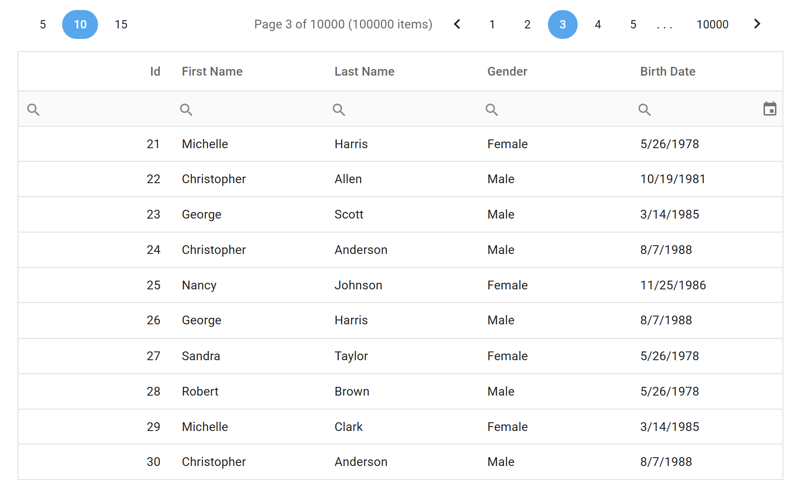

<!-- default badges list -->

<!-- default badges end -->
# DevExtreme DataGrid - Display Pager on Top

This repository demonstrates how to display the pager at the top of the DevExtreme DataGrid component. The implementation disables the built-in pager and synchronizes the DataGrid’s paging with a Pagination component rendered above it.

## Files to Review

- **Angular**
    - [app.component.html](Angular/src/app/app.component.html)
    - [app.component.ts](Angular/src/app/app.component.ts)
- **React**
    - [App.tsx](React/src/App.tsx)
- **Vue**
    - [App.vue](Vue/src/App.vue)
    - [Home.vue](Vue/src/components/HomeContent.vue)
- **jQuery**
    - [index.html](jQuery/src/index.html)
    - [index.js](jQuery/src/index.js)
- **ASP.NET Core**    
    - [Index.cshtml](ASP.NET%20Core/Views/Home/Index.cshtml)

## Documentation

- [Getting Started with DataGrid](https://js.devexpress.com/Documentation/Guide/UI_Components/DataGrid/Getting_Started_with_DataGrid/)
- [Getting Started with Pagination](https://js.devexpress.com/jQuery/Documentation/Guide/UI_Components/Pagination/Getting_Started_with_Pagination/)
- [DataGrid - API Reference](https://js.devexpress.com/Documentation/ApiReference/UI_Components/dxDataGrid/)
- [Pagination - API Reference](https://js.devexpress.com/jQuery/Documentation/ApiReference/UI_Components/dxPagination/api/)

<!-- feedback -->
## Does this example address your development requirements/objectives?

 

(you will be redirected to DevExpress.com to submit your response)
<!-- feedback end -->
